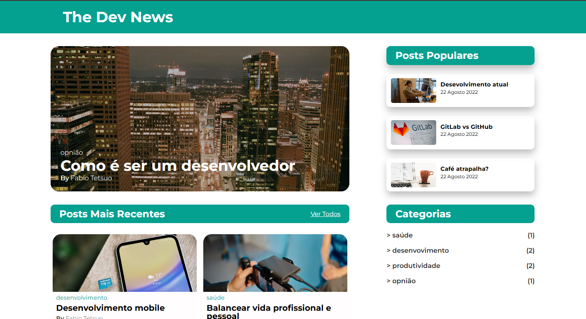
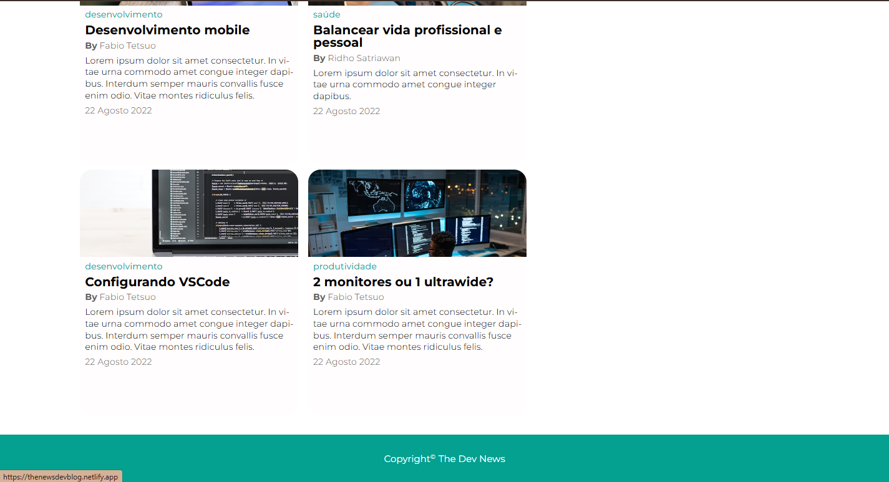
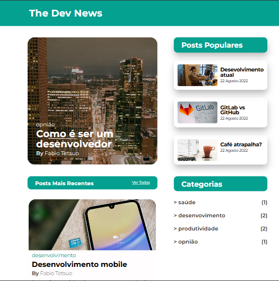
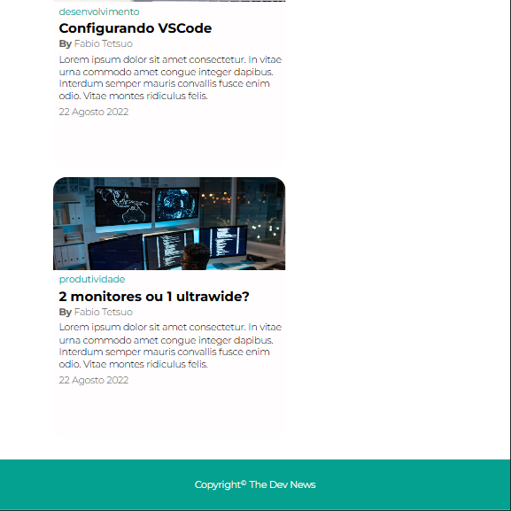
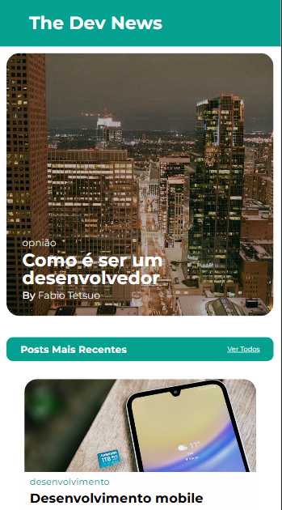
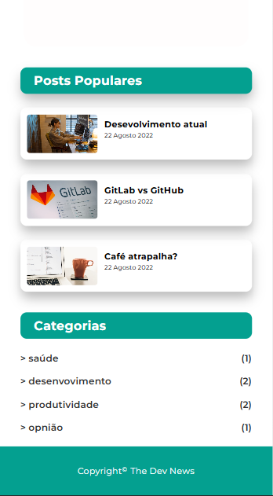
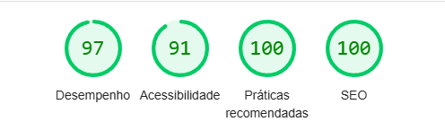

# Projeto Desafio_02RID
## 📚 Desenvolva um Blog responsivo
## 🎯 Objetivo
> O objetivo do desafio é desenvolver um blog responsivo que se adapte a qualquer dispositivo garantindo uma boa experiência do usuário a partir de um design funcional.
---
## 🔓 Execução do desafio
Para resolver este desafio eu analisei a interface proposta no prototipo do figma e observei qual seria a melhor forma de organizar o layout da página para que assim o código ficasse ainda adaptavel entre os aparelhos sem a necessidade de fazer muitas modificações através do media queries. Cheguei a conclusão de que a melhor maneira seria organizando a página com grid layout e as interfaces menos complexas seria mais viável com flex box. E para garantir que a interface ficasse responsiva com menos código utilizei medidas relativas (rem,%,vw,vh,dvw,dvh) e clamp. E vale ressaltar que a construção do blog foi feita com a semântica correta fazendo uso das tags html (header,main,section...) e com as melhores práticas para acessibilidade.
---
## Tecnologias utilizadas 🔨
- html
- css
 ---
## 📃 Critérios de Avaliação:
- Semântica
  > Verifique se as tags semânticas HTML5, como header, footer, section, e nav, foram utilizadas corretamente. As tags devem estar presentes e alinhadas com a estrutura de conteúdo definida no protótipo. 
- Unidades de medidas
  > Confirme se todas as medidas de fontes, margens, paddings, e espaçamentos utilizam unidades relativas como rem, em, ou %. 
- Componentes responsivos
  > Verifique se o layout utiliza flexbox e grid para estruturar as seções principais do blog. Media queries devem estar presentes e aplicadas corretamente para ajustar o layout em diferentes resoluções (mobile, tablet, desktop e ultrawide)
- Responsividade
  > Teste o blog em uma variedade de dispositivos e tamanhos de tela. O site deve exibir corretamente todos os elementos em resoluções de 320px (mobile) a 2560px (ultrawide) sem quebras, distorções, ou problemas de usabilidade.
---
## 📷 Imagens do Projeto
- ### Desktop 💻
  

  
  

---

- ### Tablet 

  
  

---
- ### Celular 📱
  

  
  

### Extra 🥇
> Esta foi a minha nota de SEO do meu site obtida no teste no lighthouse do google

#### Agradeço por ter visitado este projeto 👊

## Link do Projeto Publicado 🔗
[🌐link do projeto](https://thenewsdevblog.netlify.app/)